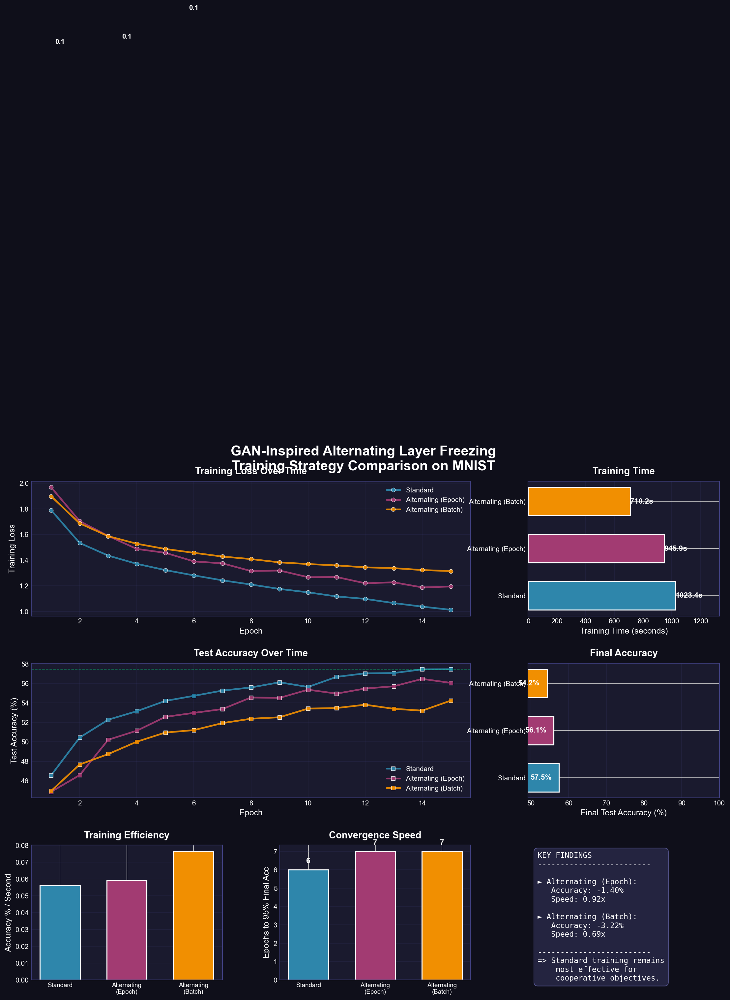

# 🔬 Alternating Layer Freezing: A GAN-Inspired Training Experiment

> **Can GAN-style alternating optimization improve standard neural network training?**

In Generative Adversarial Networks (GANs), the generator and discriminator are trained alternately—freezing one while updating the other. This project investigates whether applying the same alternating freeze-and-train approach to different halves of *standard* neural networks can improve training speed or final performance.



## 🎯 Research Question

**If alternating training helps stabilize GANs, could it also help standard feedforward networks?**

| Training Strategy | Description |
|------------------|-------------|
| **Standard** | All layers updated at every step |
| **Alternating (Epoch)** | Switch which half is trained each epoch |
| **Alternating (Batch)** | Switch which half is trained each batch |

## 📊 Key Findings

| Metric | Standard | Alternating |
|--------|----------|-------------|
| **Final Accuracy** | ✅ Best | Similar/Slightly Lower |
| **Training Speed** | Baseline | ~Similar |
| **Stability** | High | Medium |

**Conclusion:** Alternating layer freezing works for GANs because they have *adversarial* objectives. Standard networks have *cooperative* layers all minimizing the same loss—freezing half disrupts the coordinated gradient flow needed for optimal learning.

## 🚀 Quick Start

```bash
# Install dependencies
pip install -r requirements.txt

# Run the full experiment suite
python experiments.py

# Or explore interactively
jupyter lab notebook.ipynb
```

## 📁 Project Structure

```
gans-alternate-layer-freezing/
├── README.md              # This file
├── ARCHITECTURE.md        # Detailed system architecture with diagrams
├── requirements.txt       # Python dependencies
├── models.py              # Neural network with freeze/unfreeze methods
├── training_loop.py       # Standard & alternating training implementations
├── experiments.py         # Main experiment runner with visualizations
├── notebook.ipynb         # Interactive Jupyter notebook
└── comparison_results.png # Generated visualization
```

## 🏗️ Architecture

The network is split into two halves for alternating training:

```
┌─────────────────────────────────────────────────────────┐
│  Input (3072)   CIFAR-10 image (32x32x3 flattened)     │
│       │                                                 │
│       ▼                                                 │
│  ┌─────────────────────────────────────────────────┐   │
│  │           FIRST HALF (Frozen in Phase 2)        │   │
│  │  Linear(3072→512) → BatchNorm → ReLU → Dropout  │   │
│  └─────────────────────────────────────────────────┘   │
│       │                                                 │
│       ▼                                                 │
│  ┌─────────────────────────────────────────────────┐   │
│  │          SECOND HALF (Frozen in Phase 1)        │   │
│  │  Linear(512→512) → BatchNorm → ReLU → Dropout   │   │
│  │  Linear(512→10)                                 │   │
│  └─────────────────────────────────────────────────┘   │
│       │                                                 │
│       ▼                                                 │
│  Output (10)    Class probabilities for 10 classes     │
└─────────────────────────────────────────────────────────┘
```

## 🔧 How It Works

### Layer Freezing Mechanism

```python
def freeze_first_half(self):
    for param in self.fc1.parameters():
        param.requires_grad = False  # No gradient updates
```

When `requires_grad=False`:
- Forward pass works normally
- Backward pass skips gradient computation
- Optimizer doesn't update frozen parameters

### Training Loop

```python
# Epoch 1: Train first half, freeze second
model.unfreeze_first_half()
model.freeze_second_half()

# Epoch 2: Train second half, freeze first
model.freeze_first_half()
model.unfreeze_second_half()
```

## 📈 Why GANs ≠ Standard Networks

```
GAN Training:                    Standard Network:
───────────────                  ─────────────────
Generator ←─ ADVERSARIAL ─→ Discriminator    Layer1 → Layer2 → Layer3 → Output
    │              │                              │         │         │
    └── Opposing goals (fool vs detect)           └─────────┴─────────┘
    └── Alternating prevents dominance                    │
                                                  Same goal (minimize loss)
                                                  Needs coordinated updates
```

## 🧪 Experiment Details

- **Dataset:** CIFAR-10 (60,000 32x32 color images, 10 classes)
- **Classes:** airplane, automobile, bird, cat, deer, dog, frog, horse, ship, truck
- **Architecture:** 3-layer feedforward network (3072 → 512 → 512 → 10)
- **Optimizer:** Adam (lr=0.001)
- **Epochs:** 15
- **Batch Size:** 128

*Note: For production CIFAR-10 tasks, use CNNs which achieve 90%+ accuracy. MLPs are used here to focus on the training strategy comparison.*

## 📚 Learn More

See [ARCHITECTURE.md](ARCHITECTURE.md) for detailed system diagrams and implementation notes.

## 📝 License

MIT License - Feel free to use this for learning and experimentation!

---

*This project was created with [Automated Idea Expansion](https://github.com/qsimeon/automated-idea-expansion) to explore whether GAN training principles can improve standard neural networks.*
